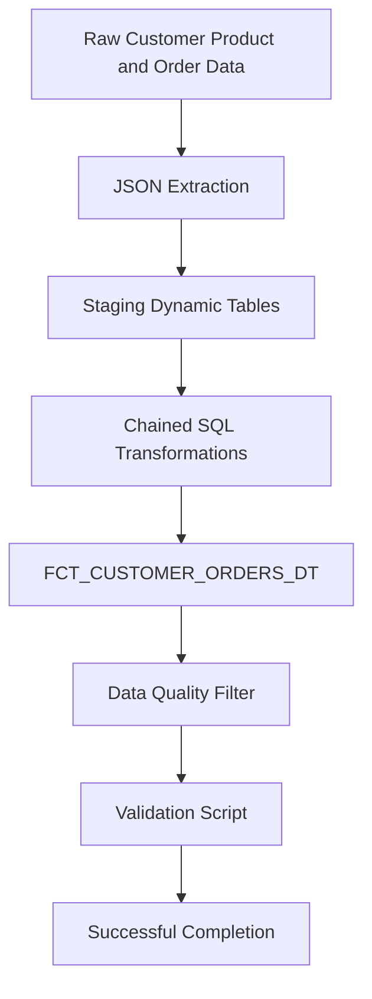

# Snowflake Dynamic Tables Data Pipeline

A declarative Snowflake data engineering pipeline using Dynamic Tables, semi-structured JSON extraction, chained transformations, data-quality filtering and automated validation.

## Project Overview

This project transforms raw customer, product and order data into analysis-ready Dynamic Tables.

The pipeline extracts values from JSON, converts them into relational SQL datatypes, joins customer and order models, and creates a final customer-order fact table.

The final validation script returned:

```text
You've successfully completed Dynamic Tables lab!
```

## Technical Environment

| Setting | Value |
|---|---|
| Role | `ACCOUNTADMIN` |
| Warehouse | `COMPUTE_WH` |
| Warehouse size | X-Small |
| Source database | `RAW_DB` |
| Analytics database | `ANALYTICS_DB` |
| Technology | Snowflake Dynamic Tables |
| Language | SQL |

## Architecture



## Pipeline Implementation

The project:

- Created staging Dynamic Tables.
- Extracted values from semi-structured JSON.
- Cast JSON values into SQL datatypes.
- Chained Dynamic Tables through dependencies.
- Used relational joins.
- Created `fct_customer_orders_dt`.
- Used `TARGET_LAG = DOWNSTREAM`.
- Applied data-quality filters.
- Ran a final validation wrapper.

## JSON Transformation

An example transformation used in the project is:

```sql
purchase:"prodid"::NUMBER(5)
```

This extracts the `prodid` JSON value and converts it into a numeric SQL datatype.

## Data Quality Control

The pipeline uses:

```sql
WHERE product_id IS NOT NULL
```

This prevents unresolved product records from entering the final analytical output.

## Validation

The final `Lab2COMP.sql` file checks:

- Required databases
- Required functions
- Required raw tables
- Required Dynamic Tables
- Final fact-table integration
- Data-quality filtering
- Successful pipeline completion

## Final Result

| STATUS |
|---|
| You've successfully completed Dynamic Tables lab! |

## Repository Structure

```text
.
├── sql
│   ├── setupforlab2.sql
│   ├── create-dt.sql
│   ├── chaining-dt.sql
│   ├── pipeline.sql
│   └── Lab2COMP.sql
└── screenshots
    ├── validation-success.png
    ├── dynamic-table-output.png
    └── snowflake-workspace.png
```

## Execution Order

```text
1. setupforlab2.sql
2. create-dt.sql
3. chaining-dt.sql
4. pipeline.sql
5. Lab2COMP.sql
```

## Project Evidence

### Final Validation


### Dynamic Table Output


### Snowflake Workspace


## Skills Demonstrated

- Snowflake Dynamic Tables
- Declarative pipelines
- DAG dependencies
- JSON extraction
- SQL datatype casting
- Relational joins
- Fact-table modelling
- Data-quality filtering
- SQL validation
- Technical documentation

## Project Context

This project was completed in a Snowflake learning environment. This repository documents my completed implementation, SQL scripts, validation output and understanding of the pipeline.
