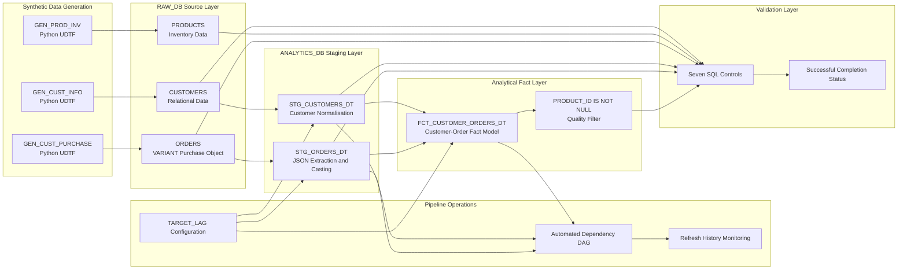
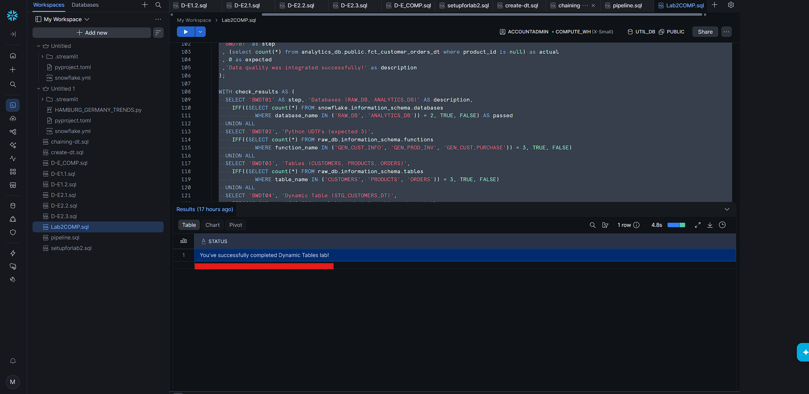
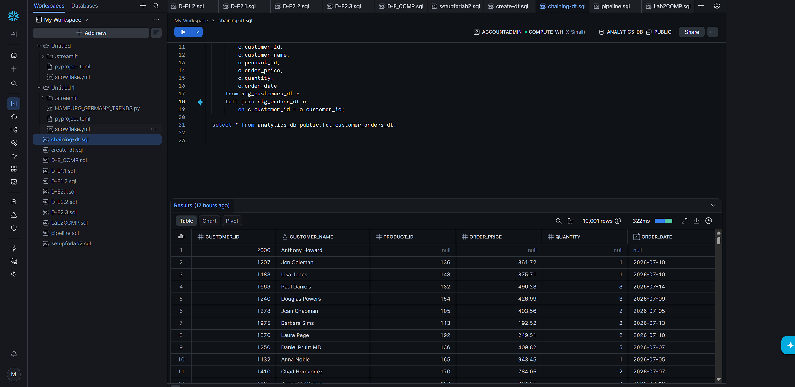
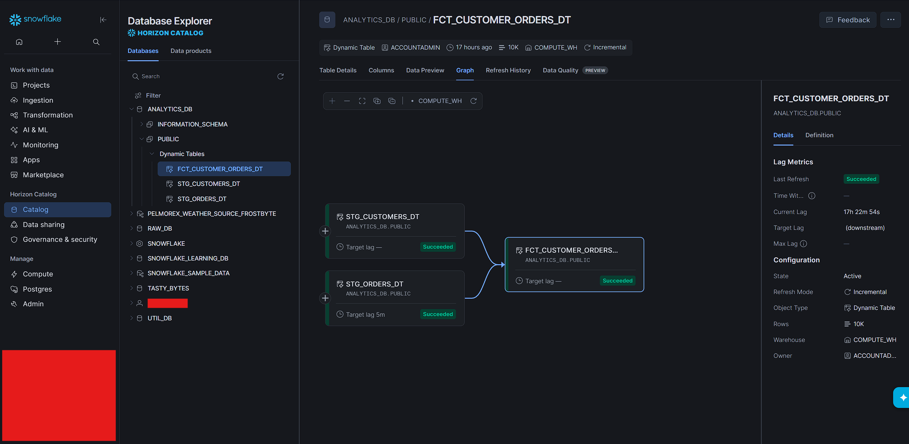

# Snowflake Declarative Dynamic Tables Pipeline

<p align="center">
  
  
  
  
  
  
</p>

<p align="center">
  <strong>
    A declarative Snowflake data pipeline that generates synthetic commerce data,
    transforms semi-structured JSON into relational models, chains Dynamic Tables
    into an analytical fact layer and validates the completed system through automated SQL controls.
  </strong>
</p>

<p align="center">
  Dynamic Tables • JSON extraction • Python UDTFs • DAG dependencies • Data quality • Automated validation
</p>

---

## Executive Summary

This project implements a multi-stage analytical pipeline using **Snowflake Dynamic Tables**.

The environment begins with Python user-defined table functions that generate synthetic customer, product and purchase data. The purchase records contain semi-structured `VARIANT` objects, which are unpacked into explicitly typed relational columns inside staging Dynamic Tables.

Those staging models are then chained into a final customer-order fact table. Snowflake manages the dependency relationships between each layer, creating a declarative pipeline in which downstream analytical objects depend on upstream transformed models.

The final implementation also demonstrates:

- Dynamic Table refresh configuration
- `TARGET_LAG = DOWNSTREAM`
- Time-based refresh settings
- Refresh-history inspection
- Relational fact-table modelling
- Data-quality filtering
- A seven-control SQL validation framework

> [!IMPORTANT]
> The completed pipeline passed every supplied validation control and returned:
>
> **You've successfully completed Dynamic Tables lab!**

---

## Recruiter Snapshot

| Engineering Area | Implementation |
|---|---|
| Cloud data platform | Snowflake |
| Pipeline architecture | Declarative Directed Acyclic Graph |
| Source layer | `RAW_DB` |
| Analytical layer | `ANALYTICS_DB` |
| Synthetic data generation | Three Python user-defined table functions |
| Python package | Faker |
| Semi-structured data | Snowflake `VARIANT` |
| JSON transformation | Path extraction with explicit datatype casting |
| Staging models | `STG_CUSTOMERS_DT` and `STG_ORDERS_DT` |
| Fact model | `FCT_CUSTOMER_ORDERS_DT` |
| Dependency strategy | `TARGET_LAG = DOWNSTREAM` |
| Scheduled refresh example | Five-minute target lag |
| Pipeline monitoring | Dynamic Table metadata and refresh history |
| Data-quality control | Removal of unresolved `PRODUCT_ID` records |
| Validation | Seven automated SQL controls |
| Final result | All required infrastructure, models and quality checks passed |

---

## Business Problem

Operational data is often created in formats that are unsuitable for direct analytical use.

In this project:

- Customer data begins as one relational structure.
- Product inventory is generated separately.
- Purchase records contain nested attributes inside a semi-structured object.
- Customer and order models must be synchronised before producing a useful fact table.
- Invalid or incomplete product identifiers must be prevented from entering the trusted analytical layer.

The engineering challenge is therefore:

> **How can raw relational and semi-structured commerce data be transformed into a maintained, analysis-ready fact model without manually orchestrating every dependency?**

The solution uses Snowflake Dynamic Tables to define the desired transformed outputs while Snowflake manages the dependency chain between them.

---

# Architecture



---

## Declarative Dependency Flow

```text
Python UDTFs
     ↓
RAW_DB source tables
     ↓
STG_CUSTOMERS_DT ───────┐
                        ├──→ FCT_CUSTOMER_ORDERS_DT
STG_ORDERS_DT ──────────┘
     ↓
Data-quality filtering
     ↓
Validated analytical output
```

Unlike a sequence of unrelated SQL scripts, each Dynamic Table declares its source dependencies.

This allows Snowflake to understand the transformation graph:

```text
Raw sources
    ↓
Staging transformations
    ↓
Joined fact model
    ↓
Trusted analytical result
```

---

# Implementation

## 1. Environment Provisioning

The setup script creates separate databases for source data and analytical models.

### Core environment

```text
Role:      ACCOUNTADMIN
Warehouse: COMPUTE_WH
Source:    RAW_DB
Analytics: ANALYTICS_DB
```

### Database separation

```text
RAW_DB
→ Generated operational source data

ANALYTICS_DB
→ Staging and fact Dynamic Tables
```

Separating the raw and analytical layers creates a clearer boundary between:

- Source generation
- Transformation logic
- Analytical consumption
- Validation

### Setup file

```text
snowflake-dynamic-tables-pipeline/sql/setupforlab2.sql
```

---

## 2. Synthetic Data Generation with Python UDTFs

The project creates three Python user-defined table functions using the Faker package.

### Customer generator

```text
GEN_CUST_INFO
```

Produces:

- Customer identifier
- Customer name
- Spending limit

The function is used to generate:

```text
1,000 customer records
```

### Product inventory generator

```text
GEN_PROD_INV
```

Produces:

- Product identifier
- Generated product name
- Stock level
- Stock date

The function is used to generate:

```text
100 product records
```

### Customer purchase generator

```text
GEN_CUST_PURCHASE
```

Produces:

- Customer identifier
- Semi-structured purchase object

The function is used to generate:

```text
10,000 order records
```

### Why use Python UDTFs?

The Python functions provide repeatable test data without requiring an external source system.

They also demonstrate how Snowflake can combine:

```text
Python data generation
        +
SQL table creation
        +
VARIANT storage
        +
Dynamic Table transformations
```

---

## 3. Raw Source Model

The generated data is written into three source tables:

```text
RAW_DB.PUBLIC.CUSTOMERS
RAW_DB.PUBLIC.PRODUCTS
RAW_DB.PUBLIC.ORDERS
```

### Customers

The customer source includes:

```text
CUSTID
CNAME
SPENDLIMIT
```

### Products

The product source includes:

```text
PID
PNAME
STOCK
STOCKDATE
```

### Orders

The order source contains:

```text
CUSTID
PURCHASE
```

`PURCHASE` is a Snowflake `VARIANT` object containing nested attributes such as:

```json
{
  "prodid": 142,
  "quantity": 3,
  "purchase_amount": 485.50,
  "purchase_date": "2026-07-10"
}
```

This design creates a realistic transformation requirement: the nested purchase attributes must be extracted and typed before the records can be joined into an analytical model.

---

## 4. Customer Staging Dynamic Table

The first staging model is:

```text
ANALYTICS_DB.PUBLIC.STG_CUSTOMERS_DT
```

### Transformation

```sql
CREATE OR REPLACE DYNAMIC TABLE stg_customers_dt
TARGET_LAG = DOWNSTREAM
WAREHOUSE = compute_wh
AS
SELECT
    custid AS customer_id,
    cname AS customer_name,
    CAST(spendlimit AS FLOAT) AS spend_limit
FROM raw_db.public.customers;
```

### Responsibilities

The model:

- Renames source columns using analytical naming conventions
- Converts the spending limit into a consistent numeric datatype
- Establishes a reusable customer staging layer
- Declares that refresh timing is controlled by downstream consumers

### Why create a staging layer?

The source table is preserved in its original form while the staging model creates a stable analytical contract.

This prevents source-specific field names from spreading into every downstream query.

---

## 5. JSON Extraction and Order Staging

The second staging model is:

```text
ANALYTICS_DB.PUBLIC.STG_ORDERS_DT
```

The source `PURCHASE` object is unpacked into relational columns.

### Transformation

```sql
CREATE OR REPLACE DYNAMIC TABLE stg_orders_dt
TARGET_LAG = DOWNSTREAM
WAREHOUSE = compute_wh
AS
SELECT
    custid AS customer_id,
    purchase:"prodid"::NUMBER(5) AS product_id,
    purchase:"purchase_amount"::FLOAT AS order_price,
    purchase:"quantity"::NUMBER(5) AS quantity,
    purchase:"purchase_date"::DATE AS order_date
FROM raw_db.public.orders;
```

### Extraction pattern

```sql
purchase:"prodid"::NUMBER(5)
```

This expression performs two operations:

1. Accesses the performs two operations:

1. Accesses the `prodid` field inside the `PURCHASE` object.
2. Casts the extracted value into a relational numeric datatype.

### Resulting schema

```text
CUSTOMER_ID
PRODUCT_ID
ORDER_PRICE
QUANTITY
ORDER_DATE
```

### Why cast explicitly?

Explicit casting creates a predictable contract for:

- Joins
- Filters
- Aggregations
- Quality checks
- Downstream analytical tools

Without it, the values would remain semi-structured and harder to validate consistently.

---

## 6. Chained Customer-Order Fact Model

The staging Dynamic Tables are chained into:

```text
ANALYTICS_DB.PUBLIC.FCT_CUSTOMER_ORDERS_DT
```

### Fact-table logic

```sql
CREATE OR REPLACE DYNAMIC TABLE fct_customer_orders_dt
TARGET_LAG = DOWNSTREAM
WAREHOUSE = compute_wh
AS
SELECT
    c.customer_id,
    c.customer_name,
    o.product_id,
    o.order_price,
    o.quantity,
    o.order_date
FROM stg_customers_dt c
LEFT JOIN stg_orders_dt o
    ON c.customer_id = o.customer_id;
```

### Why use a left join?

The customer model is treated as the primary relation.

A left join preserves customer records while adding matching purchase information where available.

This is useful when the analytical requirement includes:

- Customers with purchases
- Customers without matching purchases
- Customer coverage analysis
- Order behaviour by customer

### Chaining file

```text
snowflake-dynamic-tables-pipeline/sql/chaining-dt.sql
```

---

## 7. Data-Quality Refinement

The final pipeline version recreates the fact table with the following control:

```sql
WHERE o.product_id IS NOT NULL
```

### Purpose

This prevents records with unresolved product identifiers from entering the trusted fact layer.

The filter protects downstream analysis from:

- Missing product keys
- Failed JSON extraction
- Incomplete purchase objects
- Unusable order records
- Invalid product-level metrics

### Quality rule

```text
Expected null PRODUCT_ID records: 0
```

This condition is tested again in the final validation script.

### Pipeline file

```text
snowflake-dynamic-tables-pipeline/sql/pipeline.sql
```

---

# Pipeline Scheduling and Operations

## 8. `TARGET_LAG = DOWNSTREAM`

The staging and fact models use:

```sql
TARGET_LAG = DOWNSTREAM
```

This means their refresh behaviour is driven by downstream data requirements rather than an independent time target on every intermediate object.

### Why use downstream lag?

It creates an efficient dependency-oriented model:

```text
Intermediate table
→ Refreshes when required by a downstream consumer
```

This is useful when intermediate models exist mainly to support a final analytical output.

---

## 9. Time-Based Refresh Configuration

The project also demonstrates changing the order staging table to:

```sql
ALTER DYNAMIC TABLE stg_orders_dt
SET TARGET_LAG = '5 minutes';
```

This shows the difference between:

```text
DOWNSTREAM
→ Dependency-driven refresh behaviour
```

and:

```text
'5 minutes'
→ Time-based freshness requirement
```

The experiment demonstrates that refresh behaviour can be adjusted without rebuilding the complete source environment.

---

## 10. Dynamic Table Monitoring

The pipeline includes operational queries such as:

```sql
SHOW DYNAMIC TABLES;
```

and:

```sql
SELECT *
FROM TABLE(
    INFORMATION_SCHEMA.DYNAMIC_TABLE_REFRESH_HISTORY()
);
```

These commands expose information related to:

- Dynamic Table definitions
- Scheduling configuration
- Refresh state
- Refresh history
- Operational troubleshooting

This makes the project more than a transformation exercise—it also demonstrates how the pipeline can be inspected after deployment.

---

# Automated Validation

## 11. Seven-Control Validation Framework

The final script verifies every required layer of the implementation.

| Control | Validation |
|---|---|
| `BWDT01` | `RAW_DB` and `ANALYTICS_DB` both exist |
| `BWDT02` | Three Python UDTFs exist |
| `BWDT03` | `CUSTOMERS`, `PRODUCTS` and `ORDERS` exist |
| `BWDT04` | `STG_CUSTOMERS_DT` exists |
| `BWDT05` | `STG_ORDERS_DT` exists |
| `BWDT06` | `FCT_CUSTOMER_ORDERS_DT` exists |
| `BWDT07` | The final fact table contains zero null `PRODUCT_ID` values |

The checks are combined through a Common Table Expression:

```sql
WITH check_results AS (
    -- Individual infrastructure and quality controls
)
SELECT
    CASE
        WHEN SUM(IFF(passed, 0, 1)) = 0
        THEN 'You''ve successfully completed Dynamic Tables lab!'
        ELSE 'Not all steps passed...'
    END AS status
FROM check_results;
```

### Why use a control wrapper?

A single final status is easier to rerun and interpret than manually checking each database object.

The wrapper provides:

- Structural verification
- Data-quality verification
- Repeatability
- Clear failure identification
- End-to-end completion evidence

### Validation file

```text
snowflake-dynamic-tables-pipeline/sql/Lab2COMP.sql
```

## Final Result

```text
You've successfully completed Dynamic Tables lab!
```



> [!TIP]
> The final result confirms that all seven required infrastructure, transformation and data-quality controls passed.

---

# Project Evidence

## Snowflake Workspace

The implementation was organised across separate setup, staging, chaining, pipeline and validation scripts.



## Dynamic Table Output

The completed analytical output demonstrates the chained customer and order model after JSON extraction and relational transformation.



## Validation Result

The SQL control framework confirms the required objects and quality conditions were successfully implemented.


---

# Repository Structure

```text
snowflake-declarative-data-pipeline/
│
├── README.md
│
└── snowflake-dynamic-tables-pipeline/
    │
    ├── sql/
    │   ├── setupforlab2.sql
    │   ├── create-dt.sql
    │   ├── chaining-dt.sql
    │   ├── pipeline.sql
    │   └── Lab2COMP.sql
    │
    └── screenshots/
        ├── dynamic-table-output.png
        ├── snowflake-workspace.png
        └── validation-success.png
```

---

# Execution Order

## Environment setup

```text
1. snowflake-dynamic-tables-pipeline/sql/setupforlab2.sql
```

Creates:

- `COMPUTE_WH`
- `RAW_DB`
- `ANALYTICS_DB`
- Three Python UDTFs
- Customer, product and order source tables

## Staging Dynamic Tables

```text
2. snowflake-dynamic-tables-pipeline/sql/create-dt.sql
```

Creates:

- `STG_CUSTOMERS_DT`
- `STG_ORDERS_DT`

## Chained fact model

```text
3. snowflake-dynamic-tables-pipeline/sql/chaining-dt.sql
```

Creates:

- `FCT_CUSTOMER_ORDERS_DT`

## Pipeline refinement and monitoring

```text
4. snowflake-dynamic-tables-pipeline/sql/pipeline.sql
```

Implements:

- Target-lag adjustment
- Refresh-history inspection
- Final data-quality filter

## Final validation

```text
5. snowflake-dynamic-tables-pipeline/sql/Lab2COMP.sql
```

Validates:

- Infrastructure
- Python UDTFs
- Raw tables
- Dynamic Tables
- Fact model
- Data quality

---

# Engineering Decisions

## Why separate `RAW_DB` and `ANALYTICS_DB`?

The separation creates a clear boundary between source data and transformed analytical models.

It also makes lineage easier to understand:

```text
RAW_DB
→ Operational source layer

ANALYTICS_DB
→ Curated transformation layer
```

## Why generate synthetic data inside Snowflake?

The Python UDTFs create repeatable development data without requiring external files, APIs or databases.

This keeps the full environment reproducible from SQL.

## Why store purchases as `VARIANT`?

The source model simulates a semi-structured operational payload in which purchase attributes arrive inside one object.

This creates a realistic need for schema extraction and type enforcement.

## Why create staging Dynamic Tables?

The staging models isolate source-specific logic from the final fact layer.

They also provide reusable contracts for downstream models.

## Why use declarative dependencies?

Each Dynamic Table describes the required output while Snowflake tracks the relationships between the models.

This reduces the need to manually coordinate separate transformation tasks.

## Why monitor refresh history?

A data pipeline must be observable after creation.

Refresh-history queries provide evidence of when and how the maintained objects were updated.

## Why filter null product identifiers?

A fact table should not expose records that cannot be linked to a valid analytical entity.

The quality filter prevents incomplete purchase data from contaminating downstream reporting.

## Why validate through SQL controls?

The seven checks make the implementation repeatable and auditable.

A future rerun can immediately show which layer failed rather than requiring manual inspection.

---

# Technical Stack

| Technology | Application |
|---|---|
| Snowflake | Cloud data platform |
| Snowflake SQL | Provisioning, transformation, monitoring and validation |
| Dynamic Tables | Declarative pipeline modelling |
| Python UDTFs | Synthetic source-data generation |
| Faker | Customer and product test-data generation |
| `VARIANT` | Semi-structured purchase storage |
| JSON path extraction | Conversion of nested values into relational columns |
| `TARGET_LAG` | Freshness and dependency configuration |
| Dynamic Table refresh history | Pipeline observability |
| SQL CTEs | Consolidated validation framework |
| GitHub | Source control and technical documentation |

---

# Skills Demonstrated

```text
Snowflake data engineering
Declarative data pipelines
Dynamic Tables
Directed Acyclic Graph dependencies
Python user-defined table functions
Synthetic data generation
Faker
Semi-structured data
Snowflake VARIANT
JSON path extraction
Explicit datatype casting
Relational data modelling
Staging models
Fact-table construction
SQL joins
Target-lag configuration
Pipeline monitoring
Data-quality filtering
Automated SQL validation
Technical documentation
```

---

# What This Project Demonstrates

This repository provides evidence that I can:

- Provision a complete Snowflake development environment
- Generate repeatable source data with Python UDTFs
- Work with both relational and semi-structured records
- Extract nested JSON attributes into typed SQL fields
- Build reusable staging models
- Chain transformation layers through Dynamic Table dependencies
- Construct an analytical fact table
- Configure dependency-driven and time-based refresh behaviour
- Inspect Dynamic Table refresh history
- Apply data-quality controls
- Validate infrastructure and transformation outcomes through SQL
- Explain the architecture and engineering decisions clearly

---

# Security

This repository does not contain:

```text
Passwords
Private keys
Snowflake connection files
config.toml
connections.toml
.env files
Authentication tokens
```

Private authentication information remains outside the repository.

---

# Scope and Limitations

This implementation was completed in a controlled Snowflake learning environment using generated demonstration data.

It demonstrates production-relevant engineering patterns, but it is not presented as an independently deployed enterprise production system.

A production implementation would additionally require:

- Least-privilege custom roles
- Separate development, testing and production environments
- Infrastructure as code
- CI/CD deployment controls
- Source-data contracts
- Automated regression tests
- Monitoring and alerting
- Cost and warehouse-usage controls
- Formal data ownership
- Data-retention policies
- Documented service-level objectives

---

# Acknowledgements

This project was completed through Snowflake’s **Creating Declarative Data Pipelines with Dynamic Tables** learning lab.

Snowflake provided the original scenario, workshop requirements and validation framework. This repository documents my completed implementation, transformation logic, Dynamic Table architecture, data-quality controls and validation evidence.
